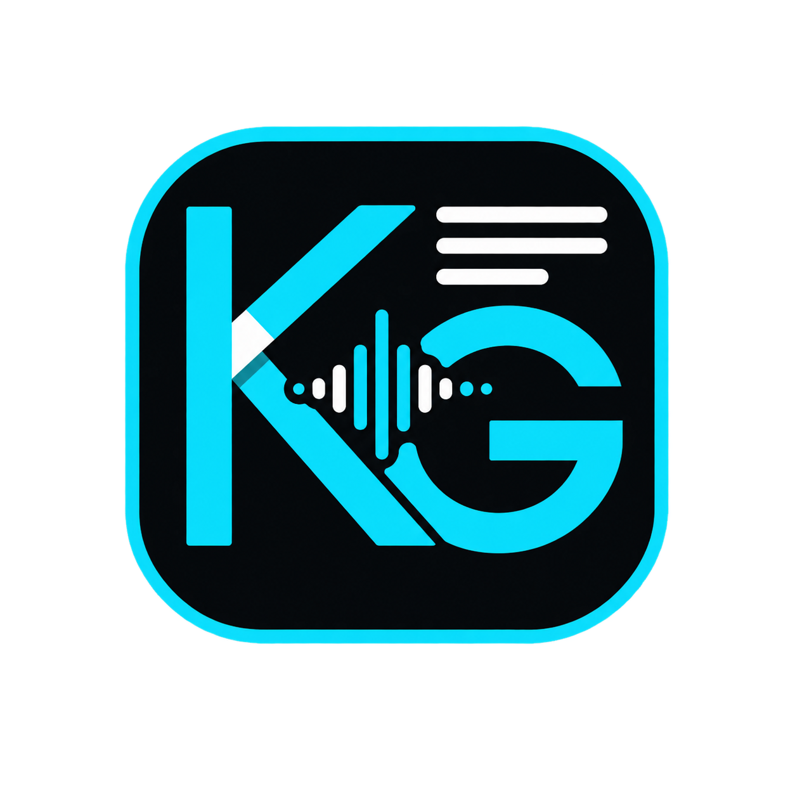

# Klanggeist Lyrics Studio




Klanggeist Lyrics Studio ist eine lokale Windows-Anwendung für den vollständigen Weg von einer Audio- oder Videodatei bis zum fertigen Lyrics-Musikvideo:

1. Gesang mit Whisper transkribieren.
2. Zeitsegmente anhören und Text korrigieren.
3. TXT, LRC, SRT und JSON synchron speichern.
4. Ein oder mehrere Bilder auswählen.
5. Mit SMART oder TATARUS eine visuelle Timeline erzeugen.
6. Ein 1080p-MP4 mit eingebrannten Lyrics exportieren.

Die Oberfläche, Audiowiedergabe, Analyse und Vorschau sind native Windows-Komponenten. Die Whisper-Inferenz läuft lokal in einem getrennten Python-Prozess. Es werden keine Songs, Lyrics, Bilder oder Lerndaten an einen Klanggeist-Dienst übertragen.

## Download

Die fertigen Pakete befinden sich unter [GitHub Releases](https://github.com/kruemmel-python/LyricsStudio/releases/latest).

| Paket | Geeignet für | Verwendung |
|---|---|---|
| `KlanggeistLyricsStudio-2.1.2-portable.zip` | Ohne Installation, USB-Stick oder eigener Programmordner | ZIP entpacken und `KlanggeistLyricsStudio.exe` starten |
| `KlanggeistLyricsStudio-2.1.2-x64.msi` | Reguläre Windows-Installation | MSI starten; Startmenü- und Desktop-Verknüpfung werden angelegt |
| `Klanggeist-FFmpeg-8.0-git-b397eba2-source.zip` | Vollständiger Quellcode des mitgelieferten GPL-FFmpeg-Forks | Nur für Quellcodeprüfung oder eigenen FFmpeg-Build erforderlich |
| `SHA256SUMS.txt` | Integritätsprüfung | SHA-256-Werte der Release-Dateien |

Die Binärpakete sind derzeit nicht mit einem kommerziellen Code-Signing-Zertifikat signiert. Windows SmartScreen kann deshalb beim ersten Start eine Rückfrage anzeigen.

## Schnellstart

### 1. Programm starten

- Portable: ZIP in einen beschreibbaren Ordner entpacken und die EXE starten.
- MSI: Installer ausführen und Klanggeist über Startmenü oder Desktop öffnen.

### 2. Whisper-Backend installieren

Für die Transkription werden Python 3.12 und `faster-whisper` benötigt. Im Programmordner einmal `INSTALL_BACKEND.bat` ausführen. Videoexport und Bearbeitung bereits vorhandener `.lyrics.json`-Dateien benötigen das Python-Backend nicht.

Beim ersten Einsatz eines Modells lädt `faster-whisper` dessen Dateien in den lokalen Ordner `.hf`. `large-v3` benötigt mehrere Gigabyte Speicherplatz.

### 3. Ersten Song transkribieren

1. `TRANSKRIBIEREN` öffnen.
2. Mit `+ DATEI` einen Song oder mit `+ ORDNER` einen Musikordner wählen.
3. Über `AUSGABE` den Lyrics-Zielordner festlegen.
4. Modell, Gerät, Präzision und Sprache einstellen.
5. `START` drücken.

### 4. Lyrics prüfen

1. `LYRICS EDITOR` öffnen.
2. Song und anschließend ein Segment auswählen.
3. Mit `▶ SEGMENT` anhören, Text korrigieren und `ÜBERNEHMEN` drücken.
4. Mit `SPEICHERN` alle vier Ausgabeformate aktualisieren.

### 5. Video erzeugen

1. Im Lyrics Editor `VIDEO ERSTELLEN` drücken.
2. Mit `BILDER WÄHLEN` ein oder mehrere Bilder laden.
3. Das gewünschte `ALBUMCOVER` festlegen.
4. `SMART`, `TATARUS` oder `TATARUS PRODUCE` anwenden.
5. Über `VIDEO-ORDNER` das Ziel wählen.
6. Vorschau prüfen und `EXPORTIEREN` drücken.

Das vollständige Bedienkonzept steht im [UI-Handbuch](docs/HANDBUCH.md).

## Hauptfunktionen

- Einzeldateien und Ordner rekursiv transkribieren
- Unterstützte Eingaben: MP3, WAV, FLAC, M4A, AAC, OGG, OPUS, WMA, MP4, MKV und WEBM
- Lokale Whisper-Modelle: `large-v3`, `turbo`, `medium`, `small`
- CPU oder CUDA mit passenden Compute-Typen
- Automatische Erzeugung von TXT, LRC, SRT und strukturiertem JSON
- Resume-/Skip-Logik anhand von Dateigröße, Änderungszeit und Whisper-Modell
- Watch-Modus für neue Dateien im zuletzt gewählten Musikordner
- Integrierter segmentbasierter Lyrics-Editor mit Confidence-Prüfstellen
- Native Audiowiedergabe über Media Foundation und XAudio2
- Mehrbild-Videos mit Crossfades, harten Schnitten, Zoom und Drift
- Audioanalyse für Energie, Onsets, Pausen und Songbereiche
- TATARUS Visual Brain mit lokalem, persistentem Lernen
- Albumcover-Lock und Diversity Planner
- Schneller FFmpeg-Export als H.264/AAC-MP4 in 1920 × 1080 bei 30 FPS
- Nativer Direct2D-/Media-Foundation-Fallback, falls FFmpeg nicht verfügbar ist
- Hintergrundexport mit Fortschritt, Abbruch und atomarer Veröffentlichung der MP4

## SMART und TATARUS

`SMART` ist der deterministische Referenzplaner. Er verteilt die geladenen Bilder ungefähr gleichmäßig und verschiebt Bildgrenzen zu geeigneten Onsets oder Pausenenden.

`TATARUS` ergänzt diese Analyse um lokale gelernte Präferenzen für Schnittzeitpunkte, Übergänge, Bewegung, Lyrics-Größe und Bildauswahl. Es ist kein LLM und kein Cloud-Dienst. Der Lerner arbeitet mit kleinen numerischen Merkmalsvektoren und speichert seine Gewichte neben der EXE in `tatarus_visual_brain.json`.

`TATARUS PRODUCE` geht einen Schritt weiter: Es erkennt heuristisch Intro, Verse, Pre-Chorus, Chorus, Bridge, Instrumental und Outro, erzeugt je nach Abschnitt unterschiedlich dichte Produktionsslots und belegt sie mit passenden Bildern und Stilen.

Die genaue Sensorik, Bewertung, Lernregeln, Grenzen und Datenschutzmerkmale sind in [TATARUS im Detail](docs/TATARUS.md) dokumentiert.

## Ausgabeformate

Zu jeder Transkription entstehen:

| Datei | Inhalt |
|---|---|
| `Titel.lyrics.txt` | Reiner Lyrics-Text |
| `Titel.lyrics.lrc` | Zeilen mit LRC-Zeitmarken |
| `Titel.lyrics.srt` | Untertitelblöcke im SRT-Format |
| `Titel.lyrics.json` | Quelle, Pipeline-Metadaten, Sprache, Dauer, Segmente und Confidence-Werte |

Der Videoexport erzeugt `Titel.mp4` mit H.264-Video, AAC-Audio und eingebrannten Lyrics.

## Systemvoraussetzungen

### Fertige Anwendung

- Windows 10 oder Windows 11, x64
- Für Transkription: Python 3.12 und Internetzugriff beim ersten Modell-Download
- Für CUDA: kompatible NVIDIA-GPU und eine zu `faster-whisper`/CTranslate2 passende CUDA-Laufzeit
- Für reine Lyrics-Bearbeitung und Videoexport aus bestehenden JSON-Dateien ist kein Python erforderlich

### Eigenen Build erstellen

- Visual Studio 2022 mit „Desktopentwicklung mit C++“
- CMake 3.24 oder neuer
- Windows SDK
- PowerShell 7 oder Windows PowerShell 5.1
- Für MSI: .NET SDK und WiX Toolset 7

```powershell
.\BUILD_VS2022.bat
```

Komplette Release-Pakete:

```powershell
.\BUILD_RELEASE.ps1
```

Ausführliche Hinweise stehen in [Build und Release](docs/BUILD.md).

## Architektur

Die Anwendung gliedert sich in vier Bereiche:

- Native C++20-/Win32-Oberfläche mit Direct2D und DirectWrite
- Media Foundation und XAudio2 für Dekodierung, Analyse und Wiedergabe
- Persistenter Python-Worker für `faster-whisper`
- FFmpeg FAST Render Engine sowie nativer Windows-Renderer als Fallback

Mehr dazu: [Architektur](docs/ARCHITEKTUR.md).

## Lokale Dateien und Datenschutz

Folgende Laufzeitdaten werden nicht versioniert und gehören nicht in Fehlerberichte oder Pull Requests:

- `.hf/` – heruntergeladene Whisper-Modelle
- `klanggeist_studio.json` – lokale Einstellungen und Pfade
- `tatarus_visual_brain.json` – persönliche TATARUS-Lerngewichte
- `lyrics/` und `videos/` – persönliche Ausgaben

Es gibt keine Klanggeist-Telemetrie. Der Modell-Download erfolgt über die von `faster-whisper` verwendete Hugging-Face-Infrastruktur.

## Dokumentation

- [UI-Handbuch](docs/HANDBUCH.md)
- [TATARUS im Detail](docs/TATARUS.md)
- [Architektur](docs/ARCHITEKTUR.md)
- [Build und Release](docs/BUILD.md)
- [Klanggeist-FFmpeg](docs/FFMPEG.md)
- [Validierung](docs/VALIDATION.md)
- [Änderungsverlauf](docs/CHANGELOG.md)
- [Drittanbieterhinweise](THIRD_PARTY_NOTICES.md)

## Lizenz

Der Klanggeist-Quellcode steht unter der [MIT-Lizenz](LICENSE). Die mitgelieferte FFmpeg-Ausgabe ist wegen der aktivierten GPL-Komponenten unter GPLv2 oder später verfügbar. Weitere Laufzeitbibliotheken besitzen eigene Lizenzen; Einzelheiten und Quellcodeverweise stehen in [THIRD_PARTY_NOTICES.md](THIRD_PARTY_NOTICES.md).

Musik, Lyrics und Bilder bleiben Eigentum ihrer jeweiligen Rechteinhaber. Nutzerinnen und Nutzer sind selbst dafür verantwortlich, nur Material zu verarbeiten und zu veröffentlichen, für das sie die erforderlichen Rechte besitzen.
